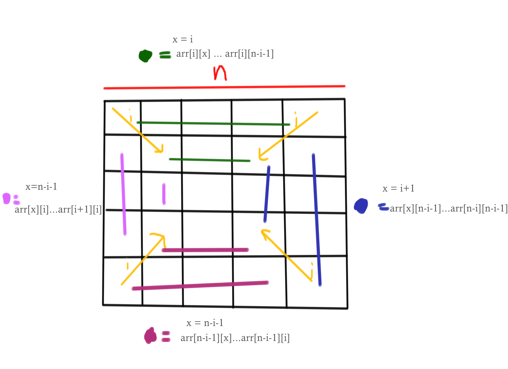

# scaling-umbrella

## Problem:
Given a number, the task is to find the next bigger number that can be formed by rearranging the digits of the given number

## Solution Flow:
1. Get the length of the array `n`. Iterate through `n/2` because array shrinking from all side. Hence we only need to iterate `n/2` time, where `i` is the iteration index
2. Push element from top. The iteration start from `arr[i][x]` to `arr[i][n-i-1]` where `x` is the iteration index startin from `i` to `n-i-1`
3. Push element from right. The iteration start from `arr[y][n-i-1]` to `arr[n-i][n-i-1]` where `y` is the iteration index startin from `i+1` to `n-i-1`
4. Push element from bottom. The iteration start from `arr[n-i-1][x]` to `arr[n-i-1][i]` where `x` is the iteration index startin from `n-i-1` to `i`
5. Push element from left. The iteration start from `arr[y][i]` to `arr[i+1][i]` where `y` is the iteration index startin from `n-i-1` to `i`
6. After iteration through all the layer, check if the 2d array is odd. If it's odd then the middle number is not included in the result array. Hence adding the middle element to result array

### Overview of solution

## Reasoning behind the Solution:

This solution breaks down the problem into smaller, more manageable sub-problems by focusing on individual layers. It's relatively easy to understand and implement. Additionally, it avoids complex data structures or recursive calls, which make the code easy to understand.

### Trade-offs and Things Left Out:

- While straightforward, this solution might not be the most concise or elegant. It involves more condition checks and loops, which could potentially impact performance for very large arrays.
- This solution assumed the array to be exact 2d box array (`i == j` where `i` = `array.length`, `j` = `array[n].length`). This solution breaks if the array isn't exactly a 2d box array.

## What I might do differently with more time

- Consider adding more comments and documentation to enhance readability and maintainability for future use.